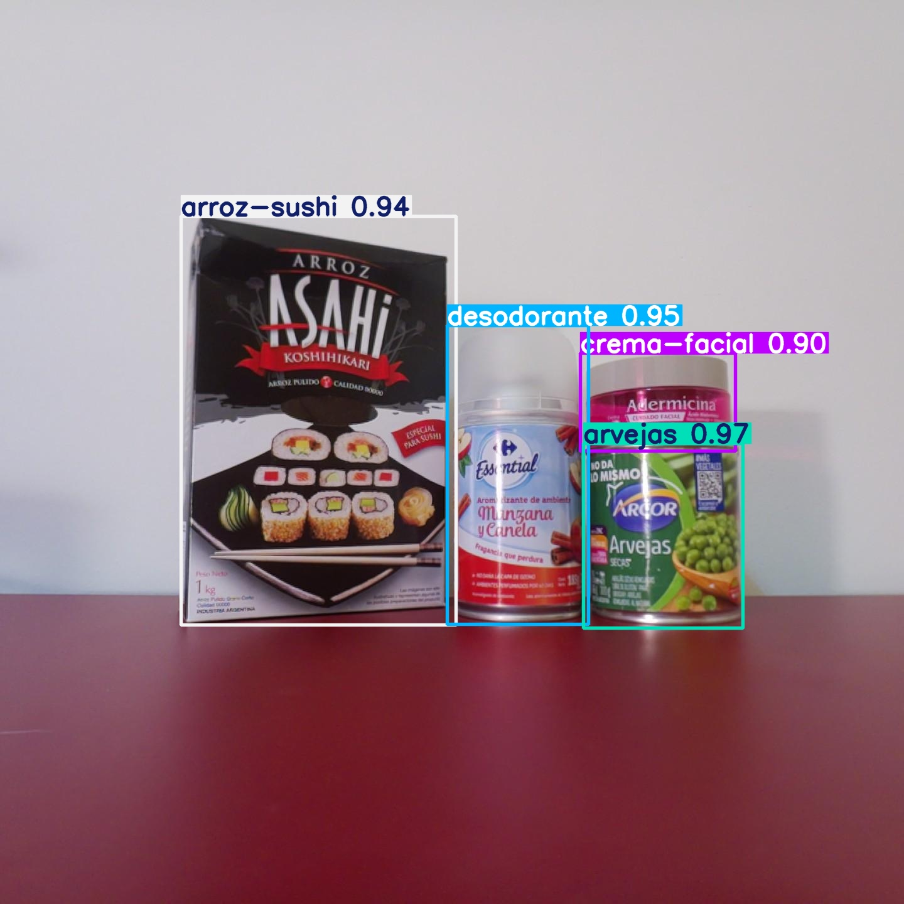

# Detección de productos en tiempo real con YOLOv8 sobre Raspberry Pi 5


## Resumen
Sistema de detección de objetos entrenado sobre un dataset propio de 20 productos y 1016 imágenes, desplegado en una Raspberry Pi 5 con inferencia en tiempo real a ~62ms por frame.
El dataset fue capturado en condiciones controladas con dos modalidades: fotos aisladas por producto (ISO) en plataforma giratoria con iluminación variable, y fotos con múltiples productos simultáneos (multi). El split train/val/test se realiza por sesión de captura para evitar data leakage. El modelo YOLOv8n alcanza mAP50-95 de 0.956 sobre el conjunto de val.

---

## Arquitectura

```
Etapa	         Dispositivo	      Función
───────────────  ─────────────────    ────────────────────────────────────────────────────  
Captura	          Raspberry Pi 5	   Recolección de imágenes en el entorno real.
Etiquetado	      PC(Roboflow)	       Clasificación manual y generación del dataset.
Entrenamiento	  PC	               Procesamiento pesado y generación del modelo .pt.
Despliegue	      PC	               Transferencia del modelo optimizado a la Pi.
Inferencia	      Raspberry Pi 5	   Ejecución del modelo para detección en tiempo real.
```

El dataset se captura con la Raspberry Pi, se etiqueta en Roboflow, se descarga y procesa en PC (merge y split por sesión), se entrena con GPU y el modelo resultante se despliega en la Raspberry Pi vía SSH.

---

## Estructura del proyecto

```
├── raspberry/                  # Código que corre en la Raspberry Pi
│   ├── capture_dataset.py      # Captura de imágenes para el dataset
│   ├── detect_products.py      # Inferencia en tiempo real
│   └── src/
│       ├── camera/             # Inicialización y captura con PiCamera2
│       └── inference/          # Procesamiento de frames y detecciones
│
├── src/                        # Código que corre en PC
│   ├── data/                   # Pipeline de dataset
│   │   ├── data_yolo.py        # Descarga desde Roboflow
│   │   ├── merge_dataset.py    # Unificación de splits
│   │   ├── split_dataset.py    # Split por sesión (train/val/test)
│   │   └── inspect_dataset.py  # Inspección y resumen del dataset
│   ├── evaluations/
│   │   └── prediction_analyzer.py  # Análisis de errores del modelo
│   ├── training/
│   │   └── training_yolo.py    # Entrenamiento YOLOv8
│   └── utils/
│       ├── config_loader.py    # Carga centralizada de configuración
│       └── files.py            # Utilidades SSH/SCP y manejo de archivos
│
├── prepare_dataset.py          # Entry point: preparación del dataset
├── run_train.py                # Entry point: entrenamiento
├── inspect_prediction.py       # Entry point: análisis de predicciones
├── update_raspi.py             # Entry point: deploy a Raspberry Pi
├── requirements.txt            # Dependencias PC
└── requirements_raspi.txt      # Dependencias Raspberry Pi
```

---

## Instalación

### PC (entrenamiento y deploy)

Requiere Python 3.12+ y CUDA para entrenamiento con GPU.

```bash
git clone https://github.com/MatiasNaranjo/ProyectoIngenieriaElectronica-MatiasNaranjo.git
cd ProyectoIngenieriaElectronica-MatiasNaranjo
python -m venv venv
venv\Scripts\activate        # Windows
pip install -r requirements.txt
```

Para torch con CUDA, instalarlo por separado según tu versión:
```bash
# Ejemplo para CUDA 11.8
pip install torch torchvision --index-url https://download.pytorch.org/whl/cu118
```

### Raspberry Pi (inferencia)
Crear el venv con --system-site-packages para que sea accesible:

```bash
python -m venv venv --system-site-packages
```

```bash
pip install -r requirements_raspi.txt
```

---

## Configuración

El proyecto usa un sistema de configuración centralizado basado en archivos YAML y variables de entorno. Los archivos siguen el patrón:

```
config/config_deploy_{device}_{func}.yaml
env/{device}_{func}.env
```

Donde `device` es `pc` o `raspi` y `func` es la funcionalidad (`train`, `dataset`, `inference`, etc.).

Los archivos de configuración y variables de entorno están en `.gitignore` por contener credenciales (API keys de Roboflow, IPs, etc.).

---

## Uso
### 1. Captura de imágenes para el dataset (Raspberry Pi)
Se captura las fotos de los distintos productos

```bash
# Fotos aisladas de un producto (modo ISO)
python capture_dataset.py --mode iso --product1 cafe
```
```bash
# Foto con múltiples productos
python capture_dataset.py --mode multi
```

### 2. Preparar el dataset

Descarga desde Roboflow, mergea los splits y los reorganiza por sesión.
Cuenta con la opción de generar subsets de entrenamiento con distintas cantidades de fotos ISO para análisis de sensibilidad.

```bash
python prepare_dataset.py
```

### 3. Entrenar el modelo
Además de entrenar el modelo final para la Raspberry Pi, permite ejecutar un ensayo donde se entrenan varios modelos con distintas cantidades de
fotos ISO y se comparan sus métricas.
```bash
python run_train.py
```

### 4. Analizar predicciones

Genera un reporte de errores (falsos positivos, falsos negativos, clase equivocada) con imágenes anotadas:

```bash
python inspect_prediction.py
```

### 5. Deploy a Raspberry Pi

Copia el modelo y los archivos necesarios a la Raspberry Pi via SSH:

```bash
python update_raspi.py
```

### 6. Inferencia en Raspberry Pi

```bash
python detect_products.py
```


---

## Dataset

- Dos tipos de imágenes: fotos aisladas por producto (ISO) y fotos con múltiples productos (multi)
- Sesiones con distintas condiciones de iluminación: luz blanca, luz cálida, luz de techo
- **20 productos** etiquetados
- Etiquetado en **Roboflow**, split train/val/test procesado en **PC**
- Split por sesión para evitar data leakage entre train/val/test

---

## Modelo

- Arquitectura: **YOLOv8n**
- Hardware de inferencia: **Raspberry Pi 5**
- Velocidad de inferencia: **~62ms por frame**
- Umbral de IoU para evaluación: **0.3** (la identidad del producto importa más que la localización exacta)

---

## Tecnologías

Herramientas y usos:
- YOLOv8 (Ultralytics): Detección de objetos
- Roboflow: Gestión y etiquetado del dataset
- Raspberry Pi 5 + PiCamera3 Wide: Captura e inferencia
- PyTorch: Entrenamiento
- OpenCV: Procesamiento de imágenes
- Pydantic: Validación de configuración
- Paramiko / SCP: Deploy remoto